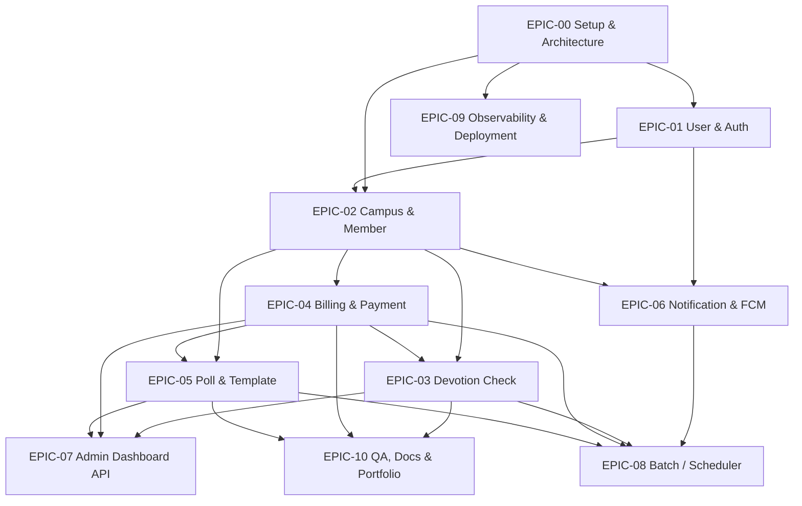
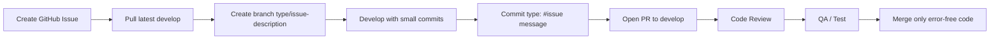
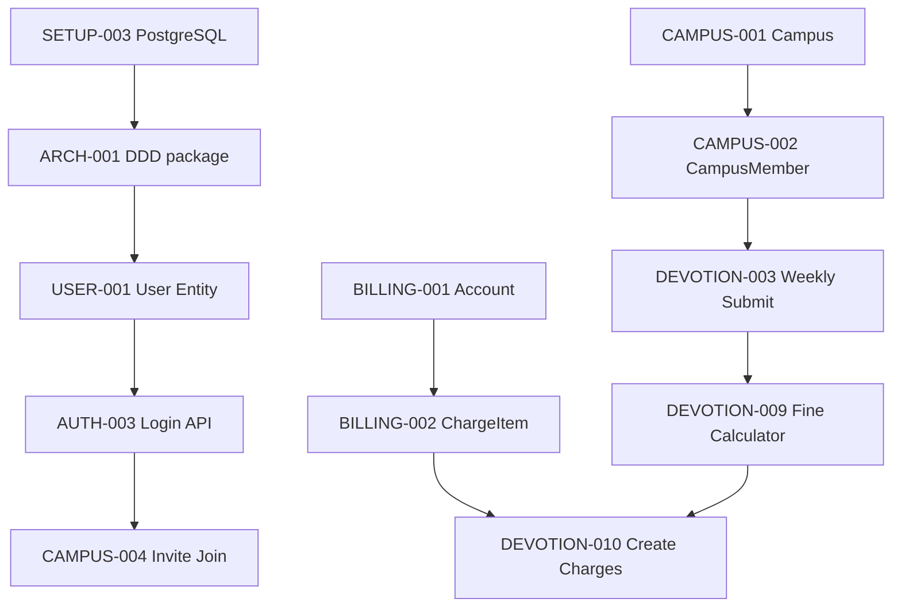
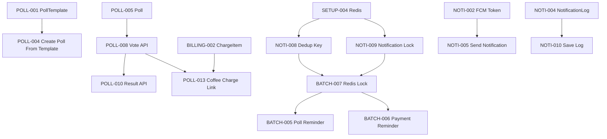

# Dependency Map

## Dependency Table

| Task | Depends On | Blocks | Reason |
| --- | --- | --- | --- |
| SETUP-003 | SETUP-001 | JPA 기반 Entity 작업 | PostgreSQL 연결과 Docker 환경이 먼저 필요합니다. |
| SETUP-004 | SETUP-001 | AUTH-004, AUTH-005, NOTI-008, NOTI-009, BATCH-007 | Redis 기반 토큰/알림/락 구현의 선행 조건입니다. |
| ARCH-001 | SETUP-001 | 모든 도메인 구현 | DDD 패키지 구조가 먼저 잡혀야 합니다. |
| ARCH-005 | - | 모든 브랜치/PR 작업 | Git-Flow와 PR 규칙 없이 협업을 시작하지 않습니다. |
| USER-001 | ARCH-001 | AUTH-003, CAMPUS-004, DEVOTION-003, POLL-008, BILLING-005 | 대부분의 사용자 기반 기능이 userId를 필요로 합니다. |
| CAMPUS-001 | ARCH-001 | devotion, poll, billing, notification 캠퍼스 기능 | 캠퍼스 단위 운영의 기준입니다. |
| CAMPUS-002 | CAMPUS-001, USER-001 | devotion, poll, billing, notification 캠퍼스 기능 | 캠퍼스 멤버와 역할이 권한의 기준입니다. |
| BILLING-001 | CAMPUS-001 | DEVOTION-010, POLL-013 | 청구 계좌와 스냅샷의 기준입니다. |
| BILLING-002 | BILLING-001, USER-001 | DEVOTION-010, POLL-013 | 청구 항목이 있어야 외부 도메인에서 청구를 생성합니다. |
| POLL-001 | CAMPUS-001 | POLL-008, POLL-010, POLL-013 | 템플릿 기반 투표 생성의 기준입니다. |
| POLL-005 | CAMPUS-001 | POLL-008, POLL-010, POLL-013 | 실제 투표 생명주기의 기준입니다. |
| NOTI-002 | USER-001 | NOTI-005, NOTI-006, 배치 알림 | 알림 대상 토큰이 필요합니다. |
| NOTI-004 | USER-001 | NOTI-005, NOTI-010 | 알림 발송 로그 저장의 기준입니다. |
| BATCH-007 | SETUP-004 | 모든 자동 알림 배치 | Redis Lock 없이 자동 배치 중복 실행을 막기 어렵습니다. |

## Epic Dependency

## Git-Flow Workflow

## Auth, Campus, Devotion, Billing

## Poll, Billing, Notification, Batch

